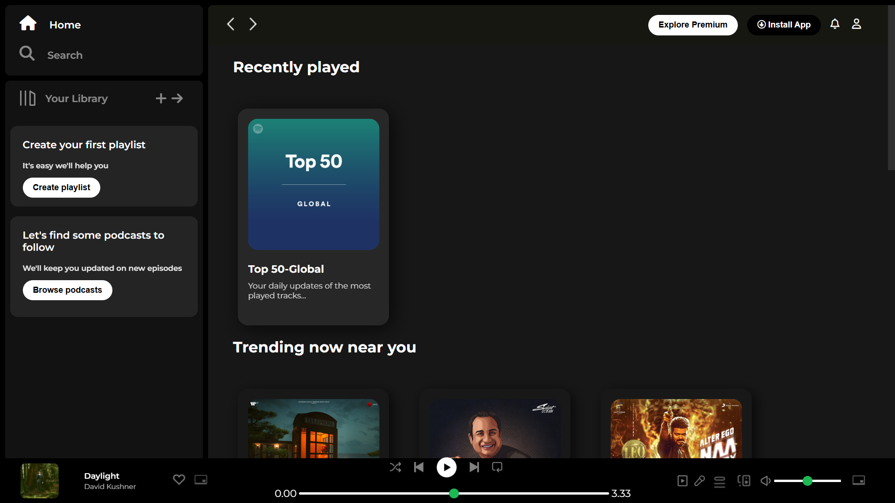
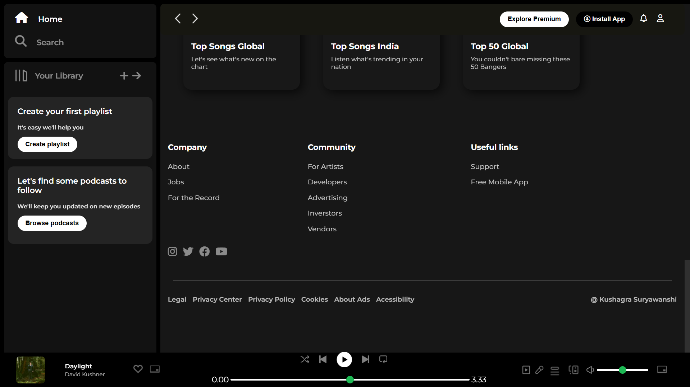

# Basic Spotify-Inspired UI

A single-page Spotify-inspired user interface built using HTML and CSS. This project is a simple, static webpage that mimics the basic layout and style of Spotify.

## Features

- **Sidebar**: A basic vertical navigation bar with links to "Home," "Search," and "Library."
- **Main Content Area**: Placeholder sections for playlists and albums, organized into simple grids.
- **Bottom Music Bar**: A fixed music player bar at the bottom with basic controls.

## Technologies Used

- **HTML5**: For page structure.
- **CSS3**: For styling and layout.

  ## Screenshots

### Full Layout

### Music Player Bar

---
---

This project is purely for visual design practice. It does not include any interactive or functional backend elements.
